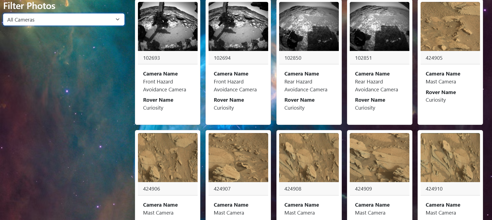

# nasaApi 
 
          Mars Rover Photo Gallery 
This is a NASA Mars Rover Photo Viewer Web App that uses the NASA Mars 
Rover API to display photos taken by the Curiosity rover on Mars. Users 
can filter the photos based on different rover cameras. 
 
      Features 
Beautiful space-themed background using Unsplash. 
 
Fetches data from NASA's Mars Rover Photos API. 
 
Displays photos taken by the Curiosity rover on sol (Martian day) 1000. 
 
Filter functionality to view photos taken by specific cameras. 
 
Fully responsive UI using Bootstrap 5. 
 
   Technologies Used 
HTML5 
 
CSS3 (with custom styles) 
 
Bootstrap 5.3 
 
JavaScript (ES6) 
 
NASA Open API 
 
      Functionality 
On page load (bodyLoad()), the app: 
 
Fetches photo data from NASA API. 
 
Dynamically displays cards for each photo. 
 
Populates a dropdown list with unique camera names. 
 
On changing the dropdown (cameraChange()): 
 
Filters the photos based on selected camera name. 
 
     How It Works 
NASA API Endpoint Used: 
 
 
https://api.nasa.gov/mars
photos/api/v1/rovers/curiosity/photos?sol=1000&api_key=DEMO_KEY 
Each photo contains: 
 
Image from Mars 
 
Photo ID 
Camera full name 
Rover name 
Cards are styled using Bootstrap and JavaScript to be dynamic and 
responsive. 
Preview 

Open index.html in your browser. 
